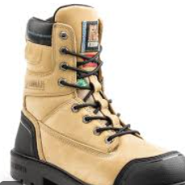

# Les accès du nouveau employé

## Préparation

Afin que l'employé soit prêt pour commencer à travailler, il est necessaire que ce dernier obtienne les items suivants:

| Item 1 | Item 2 | Item 3 |
|---|---|---|
| |||
|Bottes de sécurité. |Uniforme|Casque |

Ces items peuvent être achetés ou loués dans notre boutique qui se trouve au rez-de-chaussée du pavillon Luminous située au 1234 rue Curtis Crescent, Labrador City, Quebec, A2V 1P5. 

### Location

Un seul montant est dû pour la location.
Un dépot peut être necessaire selon si vous souhaitez qu'ABM prélève le montant sur votre paie ou si vous préférez payez le dépot directement.
À la fin de votre contrat, le dépot vous est remboursé.
Notez que s'il y a destruction du matériel ou perte des ceux-ci, le dépot ne vous sera pas remboursé.

### Diner
Sachez que nous avons une cafétéria sur les lieux de travail afin que si vous oubliez votre dîner, qu'il vous soit possible de vous nourrir.
La cafétéria est gratuit pour les employés d'ABM.

## Accueil

Lorsqu'un nouvel employé intègre notre équipe, l'entreprise ABM lui distribuera une clé magnétique pour accéder aux locaux. Sachez que votre clé est attitré à votre nom et que si vous le perdez, vous serez tenu responsable en cas de vol du matériel.

Lors de votre première journée, vous rencontrerez notre équipe pour vous faire part de nos attentes, vous rappeler les avantages du poste ainsi que les règles de sécurité.

Vous recevrez un kit de bienvenue qui vous rappelera ce qui sera dit dans cette rencontre avec notre équipe.

## Formation

Commencer avec nous, c'est vous lancer dans une aventure enrichissante. Nous vous formerons afin que vous soyez en mesure de réaliser les tâches qui vous seront données. 
Durant la formation vous serez rémunérer 80% du salaire que nous vous proposons.
Cette formation durera trois jours.
